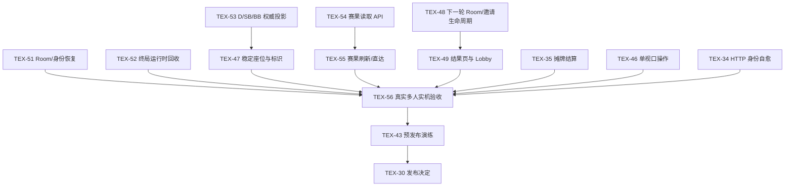

# 当前可玩能力与后续闭环路线图

> 基线：`origin/main` `ebdbce16`
>
> 更新：2026-09-12
>
> 实时状态：[Linear · Texas Hold'em](https://linear.app/texas-holdem/project/texas-holdem-70cb976c03d2)

本文是项目当前状态和后续优先级的简短入口。产品意图仍以根目录《德州扑克项目总规划》为准，工程事实仍以 `docs/01` 至 `docs/06` 和各目录 README 为准；本文不复制规则、协议或部署规格。

## 1. 当前基线

P0 已不是空工程或纯规划阶段。当前 `origin/main` 已具备：

- 纯扑克规则引擎：52 张牌、七选五牌型、No-Limit 下注、全下、主池/边池、分池、淘汰、排名和可注入随机源。
- 服务端权威运行：Room/Lobby、Tournament、服务端计时、动作与超时串行裁决、WebSocket 认证/重连、按接收者过滤的 Snapshot/Event 投影。
- 数据与恢复基础：PostgreSQL Schema/仓储、手末 Commit Bundle、异步 Writer、Tournament 手末检查点恢复和 Hand History 权限过滤读取。
- 玩家 Web：创建/加入、Lobby、响应式牌桌、服务端 `LegalActions` 驱动的下注、动画/音效、结果/设置/Hand History。
- 分层验证：unit、rules、integration、WebSocket、Playwright、Simulator、性能与监控测试入口。

River & Raise 首页与全站视觉任务 [TEX-44](https://linear.app/texas-holdem/issue/TEX-44) 以及牌桌视觉任务 [TEX-45](https://linear.app/texas-holdem/issue/TEX-45) 当前处于评审中，**尚未合并到上述 main 基线，也未据此宣告发布完成**。

## 2. 现有证据及其边界

2026-09-12 项目审阅记录了以下结果：

- 697 项单元测试通过。
- 另行执行的规则、集成和 WebSocket 测试中 43 项通过，64 项因缺少测试数据库而跳过。
- Headless Simulator 完成 200 场比赛、37,697 手牌、91,015 次动作并通过断言。

这些结果支持对规则和基础工程的信心，但不等于完整发布验收。缺少测试数据库导致的跳过项、真实多人网络、真实移动设备、服务重启恢复和连续多轮复玩仍需独立证据；最终门槛见 [测试策略](../06-testing-strategy.md) 与 [TEX-56](https://linear.app/texas-holdem/issue/TEX-56)。

## 3. 三个当前里程碑

| Linear 里程碑 | 目标 | 主要任务 |
| --- | --- | --- |
| P0 稳定性与恢复闭环 | 服务重启后可重连、终局对象可回收、身份与权威投影可恢复、赛果可持久化读取 | TEX-34、TEX-51～TEX-54 |
| P0 复玩体验闭环 | 一屏完成操作、看懂座位和结算、赛后返回同一 Lobby 并继续下一轮 | TEX-35、TEX-44～TEX-49、TEX-55 |
| P0 发布与实机验收 | 真实数据库、多人、移动设备、负载、监控、回滚和发布证据 | TEX-28～TEX-30、TEX-39～TEX-43、TEX-56 |

## 4. 审阅发现与唯一任务

| 问题 | Linear 任务 | 范围与依赖 |
| --- | --- | --- |
| HTTP 收到失效身份后重复发送旧 Token，且需防迟到旧请求误删新会话 | [TEX-34](https://linear.app/texas-holdem/issue/TEX-34) | 前端 Transport；已有任务已补全并发验收、项目归属和标签 |
| 已交付的 FINISHED 直接再开局修复状态漂移 | [TEX-37](https://linear.app/texas-holdem/issue/TEX-37) | 历史任务已校准为 Done；新产品流程由 TEX-48/49 取代，不抹除交付记录 |
| 单手摊牌、赢家公布和结算层时序不清 | [TEX-35](https://linear.app/texas-holdem/issue/TEX-35) | 前端 Showdown/结算 |
| 手机牌桌需在单视口完成所有合法动作 | [TEX-46](https://linear.app/texas-holdem/issue/TEX-46) | 前端牌桌/下注布局 |
| 5～8 人及 10 人视觉座位不保持顺时针，D/SB/BB 重连后数据不完整 | [TEX-53](https://linear.app/texas-holdem/issue/TEX-53) → [TEX-47](https://linear.app/texas-holdem/issue/TEX-47) | 先补协议/服务端权威盲注投影，再修前端映射与标识 |
| 比赛结束后不能开放同一大厅邀请新玩家并重新准备 | [TEX-48](https://linear.app/texas-holdem/issue/TEX-48) → [TEX-49](https://linear.app/texas-holdem/issue/TEX-49) | 先稳定 Room/邀请生命周期，再接结果页和 Lobby |
| 服务重启只恢复 Tournament，未恢复可认证的 Room/成员/身份关系 | [TEX-51](https://linear.app/texas-holdem/issue/TEX-51) | Urgent；服务端、持久化、认证与多客户端恢复旅程 |
| FINISHED Room/Tournament 长期留在管理器，活跃指标可能失真 | [TEX-52](https://linear.app/texas-holdem/issue/TEX-52) | 服务端运行时卸载、Tombstone、指标与 Soak |
| 结果页刷新或直接访问缺少独立权威数据源 | [TEX-54](https://linear.app/texas-holdem/issue/TEX-54) → [TEX-55](https://linear.app/texas-holdem/issue/TEX-55) | 先提供权限过滤赛果接口，再完成前端恢复与竞态处理 |
| 自动化和桌面模拟不能替代真实朋友聚会体验 | [TEX-56](https://linear.app/texas-holdem/issue/TEX-56) | 等待 TEX-35/46/47/49/55；至少两轮真实多人复玩和真实手机验收 |

本轮规划与文档校准本身由 [TEX-50](https://linear.app/texas-holdem/issue/TEX-50) 跟踪。

## 5. 建议执行顺序

TEX-51 是当前最高优先级的恢复阻塞项。TEX-53→47、TEX-54→55、TEX-48→49 可以在目录不冲突时并行推进；最终统一进入 TEX-56 的真实多人复玩，再汇入预发布与发布证据。

## 6. 状态维护规则

- Linear 是任务状态、依赖和里程碑的实时权威；本文件只提供可读入口。
- Linear/PR 标题使用 `[TEX-<number>] <可读摘要>`；Git 分支使用 `<type>/TEX-<number>-<kebab-case-summary>`。二者共享编号，但文字不要求完全相同。
- 任务改变公开接口、目录职责、运行方式或验收事实时，必须在同一 PR 更新相应 README 和 `docs/01`～`docs/06` 权威规格。
- 自动化通过不替代真实设备结论；未运行或因环境跳过的测试必须明确记录，不能视为通过。
