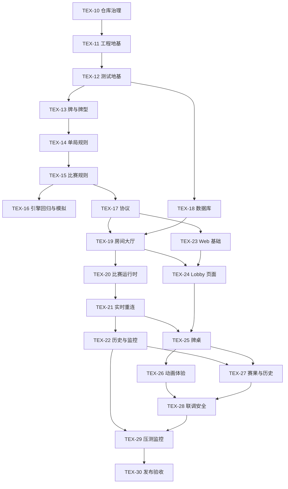

# P0 任务总览与执行顺序

> 状态：实现进行中——多数 P0 任务（TEX-11 至 TEX-29）已交付；正式负载/Soak/Headroom、监控送达验证与真实设备人工验收待 Release 阶段在隔离环境完成（见 docs/06 §10–§12）。
> 更新：2026-09-05
> Linear 项目：[Texas Hold'em](https://linear.app/texas-holdem/project/texas-holdem-70cb976c03d2)

本文件是 P0 的中文阅读入口。它不重新定义扑克规则、协议或实现细节；这些内容始终以 `docs/01` 至 `docs/06` 和根目录《德州扑克项目总规划》为权威来源。

## 1. P0 的边界

P0 的目标是交付一场可稳定完成的 2–10 人真人私人德州扑克比赛：创建/加入房间、Lobby、选座、Ready、单桌 Freezeout、实时同步、重连、基础动画和音效。

P0 **不包含** AI/DeepSeek、单人模式、账号体系、聊天、匹配、外部自由观战、支付或真钱玩法。发现这些需求时，记录为后续 P1/P2 计划，不在 P0 任务中实现。

## 2. 角色对照

| 角色 | 负责什么 | 不负责什么 |
| --- | --- | --- |
| Claude Code | 核心工程：引擎、协议、游戏服务端、牌桌 | 自行改变产品范围、规则或架构边界 |
| Trae Work | 可独立验收的测试、持久化、前端子功能、动效、监控 | 与 Claude Code 并发修改同一模块核心边界 |
| Codex | 规划、任务拆分、规格一致性、跨模块验收、发布结论 | 大规模工程实现 |
| 用户 | 产品优先级、外部服务与费用、最终发布决定 | — |

## 3. 开工顺序

`TEX-23` 只依赖 `TEX-17`，因此可与 `TEX-19` 至 `TEX-22` 的服务端链并行；`TEX-24` 同时等待 `TEX-19` 和 `TEX-23`，`TEX-25` 同时等待 `TEX-21` 和 `TEX-24`，`TEX-27` 还等待 `TEX-22`。

只有当前任务的依赖全部完成且目录范围没有和其他 Agent 冲突时，才可将它移入 `In Progress`。每个任务使用 `<type>/TEX-<number>-<kebab-case-summary>` 形式的 Git 分支；Linear/PR 标题使用 `[TEX-<number>] <可读摘要>`，两者 `TEX-<number>` 必须一致，但分支与标题格式不同（见 [CONTRIBUTING.md](../../CONTRIBUTING.md)）。Linear 自动建议的分支字段不是权威命名。

## 4. 任务地图

| 阶段 | Linear 任务 / Git 分支 | 主责 | 中文说明 | 任务卡 |
| --- | --- | --- | --- | --- |
| 地基 | [TEX-11](https://linear.app/texas-holdem/issue/TEX-11/choretex-11-bootstrap-monorepo-and-quality-baseline) `chore/TEX-11-bootstrap-monorepo-and-quality-baseline` | Claude Code | 项目、依赖、质量命令 | [基础与引擎](./p0-foundation-and-engine-tasks.md#tex-11工程地基) |
| 地基 | [TEX-12](https://linear.app/texas-holdem/issue/TEX-12/testtex-12-establish-test-infrastructure-and-fixtures) `test/TEX-12-establish-test-infrastructure-and-fixtures` | Trae Work | 测试和固定数据底座 | [基础与引擎](./p0-foundation-and-engine-tasks.md#tex-12测试地基) |
| 引擎 | [TEX-13](https://linear.app/texas-holdem/issue/TEX-13/feattex-13-implement-cards-deck-and-hand-evaluator) | Claude Code | 牌、洗牌、牌型比较 | [基础与引擎](./p0-foundation-and-engine-tasks.md#tex-13扑克牌与牌型) |
| 引擎 | [TEX-14](https://linear.app/texas-holdem/issue/TEX-14/feattex-14-implement-no-limit-hand-engine-and-pot-settlement) | Claude Code | 单局规则与边池结算 | [基础与引擎](./p0-foundation-and-engine-tasks.md#tex-14单局扑克规则) |
| 引擎 | [TEX-15](https://linear.app/texas-holdem/issue/TEX-15/feattex-15-implement-tournament-engine-and-game-events) | Claude Code | 整场比赛、淘汰、盲注 | [基础与引擎](./p0-foundation-and-engine-tasks.md#tex-15整场比赛规则) |
| 引擎 | [TEX-16](https://linear.app/texas-holdem/issue/TEX-16/testtex-16-build-engine-regression-and-simulation-suite) | Trae Work | 规则回归与随机模拟 | [基础与引擎](./p0-foundation-and-engine-tasks.md#tex-16引擎回归与模拟) |
| 服务端 | [TEX-17](https://linear.app/texas-holdem/issue/TEX-17/feattex-17-implement-protocol-schemas-and-player-projections) | Claude Code | 前后端通信与数据投影 | [服务端与数据](./p0-server-and-data-tasks.md#tex-17通信协议) |
| 服务端 | [TEX-18](https://linear.app/texas-holdem/issue/TEX-18/feattex-18-implement-supabase-schema-and-persistence-repositories) | Trae Work | 数据库结构与保存 | [服务端与数据](./p0-server-and-data-tasks.md#tex-18数据库) |
| 服务端 | [TEX-19](https://linear.app/texas-holdem/issue/TEX-19/feattex-19-implement-room-lobby-and-http-lifecycle) | Claude Code | 创建/加入房间与 Lobby 后端 | [服务端与数据](./p0-server-and-data-tasks.md#tex-19房间与大厅后端) |
| 服务端 | [TEX-20](https://linear.app/texas-holdem/issue/TEX-20/feattex-20-implement-tournament-runtime-and-authoritative-timers) | Claude Code | 权威比赛运行与计时 | [服务端与数据](./p0-server-and-data-tasks.md#tex-20比赛运行时) |
| 服务端 | [TEX-21](https://linear.app/texas-holdem/issue/TEX-21/feattex-21-implement-websocket-auth-sync-and-reconnect) | Claude Code | 实时连接、同步与重连 | [服务端与数据](./p0-server-and-data-tasks.md#tex-21实时联机与重连) |
| 服务端 | [TEX-22](https://linear.app/texas-holdem/issue/TEX-22/feattex-22-complete-hand-history-recovery-and-server-observability) | Trae Work | 手牌历史、恢复与监控 | [服务端与数据](./p0-server-and-data-tasks.md#tex-22历史记录与监控) |
| 前端 | [TEX-23](https://linear.app/texas-holdem/issue/TEX-23/feattex-23-bootstrap-web-app-and-client-transport) | Claude Code | Web 框架和传输客户端 | [前端与发布](./p0-web-and-release-tasks.md#tex-23前端基础) |
| 前端 | [TEX-24](https://linear.app/texas-holdem/issue/TEX-24/feattex-24-build-home-create-join-and-lobby-flows) | Trae Work | 首页、创建/加入、Lobby | [前端与发布](./p0-web-and-release-tasks.md#tex-24首页与大厅页面) |
| 前端 | [TEX-25](https://linear.app/texas-holdem/issue/TEX-25/feattex-25-build-responsive-poker-table-and-betting-controls) | Claude Code | 牌桌与下注操作 | [前端与发布](./p0-web-and-release-tasks.md#tex-25牌桌与下注页面) |
| 前端 | [TEX-26](https://linear.app/texas-holdem/issue/TEX-26/feattex-26-build-event-animation-audio-and-reconnect-ux) | Trae Work | 动画、音效、断线体验 | [前端与发布](./p0-web-and-release-tasks.md#tex-26动画音效与重连体验) |
| 前端 | [TEX-27](https://linear.app/texas-holdem/issue/TEX-27/feattex-27-build-results-settings-and-player-hand-history) | Trae Work | 赛果、设置、个人手牌历史 | [前端与发布](./p0-web-and-release-tasks.md#tex-27赛果设置与个人历史) |
| 验证 | [TEX-28](https://linear.app/texas-holdem/issue/TEX-28/testtex-28-implement-p0-integration-e2e-and-security-tests) | Trae Work | 全流程、重连和安全测试 | [前端与发布](./p0-web-and-release-tasks.md#tex-28联调e2e与安全测试) |
| 验证 | [TEX-29](https://linear.app/texas-holdem/issue/TEX-29/testtex-29-run-load-soak-and-monitoring-validation) | Claude Code | 压力、稳定性、监控验证 | [前端与发布](./p0-web-and-release-tasks.md#tex-29压测稳定性与监控验证) |
| 发布 | [TEX-30](https://linear.app/texas-holdem/issue/TEX-30/choretex-30-assemble-p0-release-evidence-and-acceptance) | Codex + 用户 | 发布证据与最终决定 | [前端与发布](./p0-web-and-release-tasks.md#tex-30发布验收) |

## 5. 所有任务都必须遵守的交付门槛

1. 从 Linear 任务开始，并先阅读本任务引用的权威规格和目标目录 `README.md`。
2. 只修改任务范围内的文件；发现范围外问题，单独记录，不捎带重构。
3. 协议、持久化和公开接口变化必须同步更新权威规格。
4. 提交前先由 DeepSeek Harness 本地审查 Agent 取得 `PASS`；随后填写完整 PR 模板并通过仓库 CI。
5. 完成时报告改动范围、验证结果、剩余风险和需要 Codex/用户裁决的项目。

详见 [AGENTS.md](../../AGENTS.md)、[CLAUDE.md](../../CLAUDE.md)、[TRAE.md](../../TRAE.md) 与 [CONTRIBUTING.md](../../CONTRIBUTING.md)。
